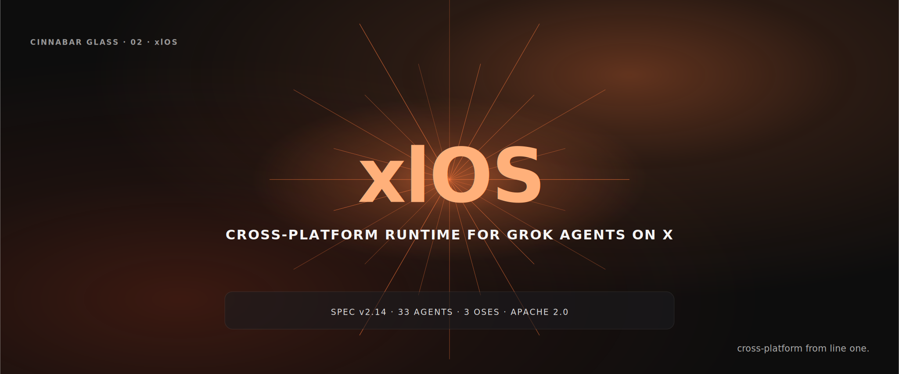

# xlOS
> Cross-platform developer runtime for Grok agents on X. Mac, Linux, Windows.



## What is this

xlOS is the open-source Python runtime that lets you install, validate,
and run Grok agents the same way on Mac, Linux, and Windows. It speaks
the `grok-install.yaml` v2.14 standard, ships with 33 production agents,
a Constitution-checked safety scanner, a bundled Next.js marketplace,
and a browser extension for one-click install from any X post. xlOS is
how developers ship Grok agents in 2026.

## Quickstart (60 seconds)

```bash
pip install xlos
xlos install agents/super-agents/living-narrative-fabric/grok-install.yaml
xlos run living-narrative-fabric
```

Works identically on Mac, Linux, Windows.

## What's included

- `xlos` CLI — install, run, list, doctor (all OSes)
- **33 production agents** under `agents/` (7 super-agents, 4 X Money tools, 22 creator templates)
- **Constitution safety scanner** — 24 named checks across 8 articles
- **X-native tools** under `tools/` — 5 shipping (4 single-file HTML + 1 hybrid) plus 7 specified for future builds
- **Marketplace** — Next.js 15 discovery surface (deployed to Vercel; production URL added post-deploy)
- **Browser extension** — one-click install from any X post (Manifest v3)
- **grok-paradoxes** — standalone Python package for contradiction detection (15 tests)

## The standard

Speaks `grok-install.yaml` v2.14. See [AgentMindCloud/grok-install](https://github.com/AgentMindCloud/grok-install) for the canonical schema. xlOS adds the optional `extensions:` block for richer agents (Constitution articles, multi-agent roles, provenance, demo metadata).

## Cross-platform support

| OS | CLI | Agents | Marketplace | Tools |
|---|---|---|---|---|
| Windows | ✓ tested in CI | ✓ | ✓ browser | ✓ browser |
| macOS | ✓ tested in CI | ✓ | ✓ browser | ✓ browser |
| Linux | ✓ tested in CI | ✓ | ✓ browser | ✓ browser |
| iOS | browser only | — | ✓ browser | ✓ browser |
| Android | browser only | — | ✓ browser | ✓ browser |

## Docs

See [docs/](docs/) for the CLI reference, agent authoring guide, schema reference, and Constitution articles. Hosted at the repo's GitHub Pages URL post-deploy.

## Contributing

See [CONTRIBUTING.md](CONTRIBUTING.md).

## License

Apache 2.0.
