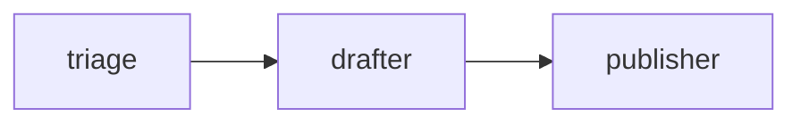
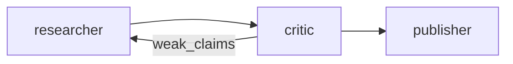
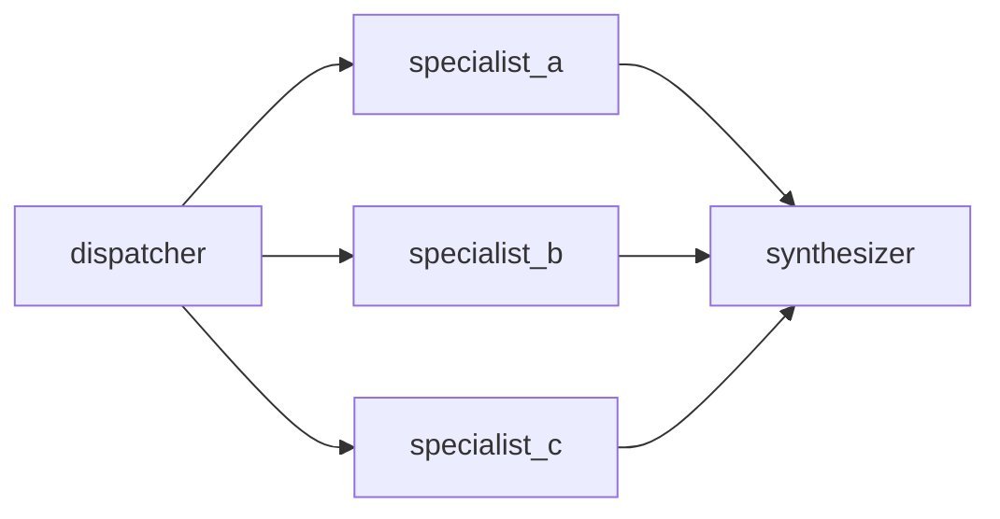

# Multi-agent swarms

When one agent isn't enough. This guide covers the three production
patterns we see most: **pipeline**, **critic loop**, and **fan-out**.

## The building blocks

- [`grok-agent.yaml`](../v2.12/spec/grok-agent-yaml.md) declares the roles.
- [`grok-workflow.yaml`](../v2.12/spec/grok-workflow-yaml.md) wires them up.
- `entrypoint: .grok/grok-workflow.yaml` in your root manifest
  activates the workflow runtime.

## Pattern 1 — Pipeline

Three agents in series. Each step's output feeds the next.



```yaml
# .grok/grok-agent.yaml
agents:
  - id: triage
    model: grok-4
    prompt_ref: triage_system
    tools: [fetch_mentions, classify_mention]
    max_turns: 6
  - id: drafter
    model: grok-4
    prompt_ref: drafter_system
    tools: [draft_reply]
    max_turns: 4
  - id: publisher
    model: grok-4
    prompt_ref: publisher_system
    tools: [post_reply]
    max_turns: 2
```

```yaml
# .grok/grok-workflow.yaml
workflow:
  id: reply_pipeline
  input_schema:
    mention_id: string
  steps:
    - id: classify
      agent: triage
      input: { mention_id: "{{ input.mention_id }}" }
      output: classification
    - id: draft
      agent: drafter
      input: { classification: "{{ classification }}" }
      output: draft_text
    - id: publish
      agent: publisher
      input: { text: "{{ draft_text }}" }
      output: posted
```

Best for: **linear workflows with distinct responsibilities** (content
moderation, reply bots, doc transformation).

## Pattern 2 — Critic loop

A researcher produces, a critic reviews, the researcher refines if
needed, a publisher finalizes.



```yaml
# .grok/grok-workflow.yaml
workflow:
  id: research_swarm
  input_schema:
    question: string
  steps:
    - id: research_round_one
      agent: researcher
      input: { question: "{{ input.question }}" }
      output: initial_findings

    - id: critique
      agent: critic
      input: { findings: "{{ initial_findings }}" }
      output: critiques

    - id: research_round_two
      agent: researcher
      when: "{{ critiques.weak_claims | length > 0 }}"
      input:
        question: "{{ input.question }}"
        gaps: "{{ critiques.weak_claims }}"
      output: refined_findings

    - id: final_brief
      agent: publisher
      input:
        findings: "{{ refined_findings | default(initial_findings) }}"
        critiques: "{{ critiques }}"
      output: brief
```

Notice the `when:` — it's a Jinja boolean. If the critic found no weak
claims, the researcher's second pass is skipped, and the publisher uses
the original findings via `default()`.

Best for: **quality-sensitive outputs** (research briefs, technical
threads, anything where fabrication is a risk).

## Pattern 3 — Fan-out

One dispatcher, N specialists, one synthesizer.



`grok-workflow.yaml` currently executes steps **sequentially**; true
parallelism is on the roadmap. For now, simulate fan-out with
independent input mappings:

```yaml
steps:
  - id: route
    agent: dispatcher
    input: { query: "{{ input.query }}" }
    output: routing

  - id: fetch_news
    agent: news_specialist
    when: "{{ 'news' in routing.topics }}"
    input: { query: "{{ input.query }}" }
    output: news_results

  - id: fetch_papers
    agent: paper_specialist
    when: "{{ 'research' in routing.topics }}"
    input: { query: "{{ input.query }}" }
    output: paper_results

  - id: synthesize
    agent: synthesizer
    input:
      news: "{{ news_results | default({}) }}"
      papers: "{{ paper_results | default({}) }}"
    output: final
```

## Tips

!!! tip "Keep prompts narrow"
    A 3-agent swarm with focused prompts beats a 1-agent mega-prompt
    every time. The model doesn't hold 500 lines of instruction well.

!!! tip "Bind every step's output"
    Always set `output:` — even if you don't think you'll use it.
    You'll want it for debugging.

!!! tip "Conditional > re-prompting"
    Prefer a `when:` gate on a second step over a prompt that says "try
    again if X". Determinism is free.

## Further reading

- [`grok-workflow.yaml` reference](../v2.12/spec/grok-workflow-yaml.md)
- [Super-agent examples](https://github.com/AgentMindCloud/xlOS/tree/main/agents/super-agents)
  in the xlOS repo.
