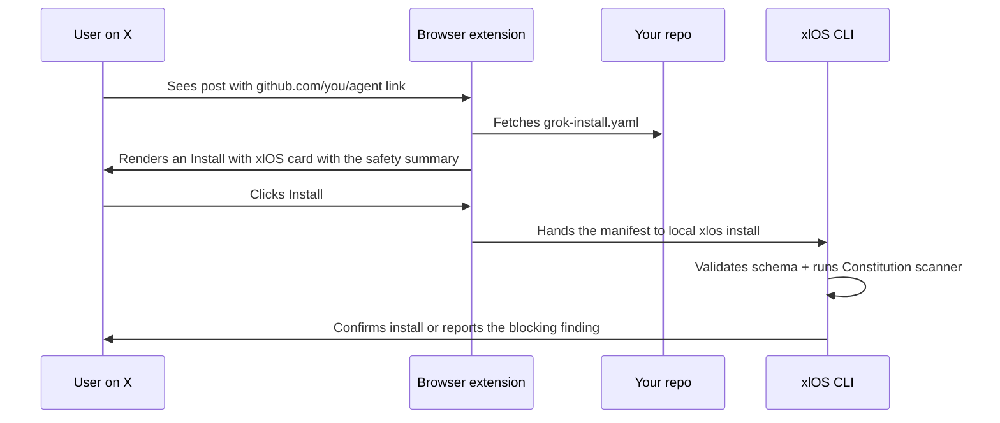

# X integration

The payoff of `grok-install` is the install-on-X flow. xlOS ships with
a browser extension that adds the **Install with xlOS** button to any X
post that links to a compatible agent repo.

## The install flow



## What makes a repo installable

1. `grok-install.yaml` at the root.
2. `spec:` declared with a supported version (`grok-install/v2.14`
   recommended; `v2.13`, `v2.12` also accepted).
3. Clean Constitution scan — no `error`-level findings.
4. Public repo (or local clone).

## Manifest fields that light up the UI

| Field                | Where it shows                                     |
| -------------------- | -------------------------------------------------- |
| `name`               | Install card title.                                |
| `description`        | Install card body.                                 |
| `category`           | Marketplace filter.                                |
| `tags`               | Marketplace search.                                |
| `on_install.welcome` | First message the agent emits after install.       |

## Constitution scan

Every install triggers a scan identical to what `xlos install` runs
locally. It reports:

- Safety profile (`standard` / `strict`).
- Permission summary (tools, network hosts, filesystem, env).
- Additional Constitution articles the agent opts into (beyond the
  unconditional core I, III, VII).
- Severity breakdown.

A clean scan unblocks the install button. Failures show the operator
which check (article + rule id) blocked the install.

## Marketplace visibility

The bundled marketplace (`marketplace/` in the xlOS repo) indexes
every agent under `agents/`. To show up:

1. Drop your agent under `agents/<category>/<name>/` with a valid
   `grok-install.yaml`.
2. The marketplace build picks up its metadata on the next
   `marketplace.yml` workflow run.

## Reply bots, DM handlers, trend monitors

`x_native_runtime` sub-types specialize the install experience and
ship sensible rate-limit defaults plus required approvals.

```yaml
# grok-install.yaml (reply bot)
x_native_runtime:
  type: reply-bot
  permissions: ["tweet.read", "tweet.write"]
  grok_orchestrator: true
```

| `type`           | Behavior                                                             |
| ---------------- | -------------------------------------------------------------------- |
| `reply-bot`      | Watches mentions, posts replies (usually approval-gated).            |
| `dm-handler`     | Watches DMs, can converse privately.                                 |
| `trend-monitor`  | Scheduled; posts when certain trends fire.                           |
| `custom`         | You own the event loop; runtime just supervises.                     |

`reply-bot` automatically gates `post_reply` unless you opt out —
which the scanner will flag.
